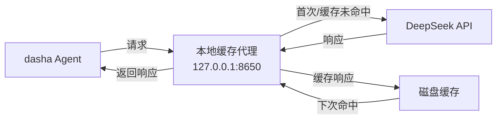

# 本地API响应缓存代理

## 适用场景

某些LLM API提供者（如DeepSeek直连）**没有服务端响应缓存**功能，而OpenRouter有。切换后缓存命中率从~95%跌至~0%，每次请求都产生费用。

解决方案：在本地架设一个HTTP缓存代理，拦截发给API的请求，将响应缓存到本地磁盘。相同请求（相同model + messages）第二次起直接从本地返回，**不产生API费用**。

## 原理



- 代理监听 `127.0.0.1:PORT`
- 转发请求到目标API
- 用请求体（JSON）的 **SHA256** 作为缓存键
- 缓存文件持久化到本地磁盘，**永不过期**
- 返回时添加 `X-Cache-Status: HIT (local)` / `BYPASS` 响应头

## 模板

模板文件：`skill_view('api-cache-proxy', 'templates/cache-proxy.py')`

通用模板，支持任何OpenAI-compatible API。修改 `TARGET_BASE` 即可切换目标。

## 配置方法

### 1. 启动代理

```bash
python /path/to/cache-proxy.py
```

默认端口8650，输出：
```
DeepSeek 缓存代理运行中: http://127.0.0.1:8650
缓存目录: ~/.dasha/cache/proxy_responses/
```

### 2. 修改config.yaml

将对应provider的 `base_url` 改为代理地址：

```yaml
deepseek:
  type: deepseek
  base_url: http://127.0.0.1:8650/v1    # 原为 https://api.deepseek.com/v1
  key_env: DEEPSEEK_API_KEY
```

### 3. 重启dasha会话

新会话走本地代理，缓存逐步积累。

## 验证方法

```python
import urllib.request, json
body = json.dumps({
    'model': 'your-model',
    'messages': [{'role': 'user', 'content': 'Say hello'}],
    'stream': False
}).encode()
req = urllib.request.Request(
    'http://127.0.0.1:8650/v1/chat/completions',
    data=body, headers={'Content-Type': 'application/json', 'Authorization': f'Bearer {key}'}
)
with urllib.request.urlopen(req, timeout=30) as resp:
    data = json.loads(resp.read())
    cache = resp.headers.get('X-Cache-Status', 'unknown')
    print(f'缓存状态: {cache}')  # 首次=BYPASS, 二次=HIT (local)
```

## 常见陷阱

1. **代理必须优先于 dasha 启动** — dasha 启动时如果代理没跑，base_url 连不上会报错。可在启动脚本或开机自启中先启动代理
2. **⚠️ 端口不能跟 dasha-web-ui 冲突（8648）** — Web UI 默认跑在 8648 端口。缓存代理绝不能用 8648，否则 Web UI 页面打开是空白/错误（Python 脚本拦截了请求，返回 `{"error":"not found"}`）。建议用 8649、8650 或其他高位端口。排查方法：`netstat -ano | findstr :8648`，看到 python.exe 在监听就是冲突了
3. **仅缓存非流式(non-streaming)响应** — 流式响应(SSE)因内容每次不同，缓存价值有限。本代理只缓存 `stream: false` 的请求
4. **缓存不自动清理** — 设计为永不过期。若需清理，手动删除缓存目录下的文件：`rm -rf ~/.dasha/cache/proxy_responses/*`
5. **API Key透传** — 代理通过 `Authorization` 头透传API Key，不存储key
6. **Windows路径注意** — 在Windows上运行时，缓存目录是 `%USERPROFILE%\\.dasha\\cache\\proxy_responses\\`

## 相关技能

- `offline-office` — 用于生成费用分析报告
- `dasha-agent` — 修改config.yaml的 provider 配置
